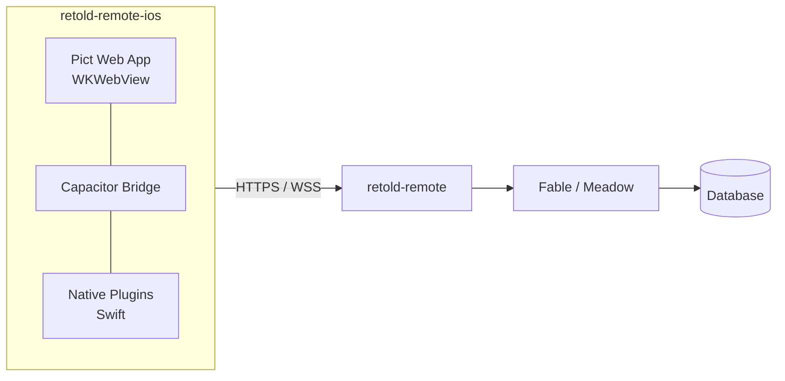

# retold-remote-ios

> An iOS client for the Retold Remote application server.

A native iOS app built with Capacitor that brings the Retold ecosystem to iPhone and iPad. Talks to a [`retold-remote`](https://github.com/stevenvelozo/retold-remote) server for dashboards, data records, file transfers, and realtime events -- with native iOS integration for notifications, biometrics, background sync, and deep links.

Part of the [Retold](https://github.com/stevenvelozo/retold) application suite.

## Install

From source:

```bash
git clone https://github.com/stevenvelozo/retold-remote-ios.git
cd retold-remote-ios
npm install
npx cap sync ios
npx cap open ios
```

Then build and run from Xcode against the Simulator or a connected device.

## Architecture at a Glance



- **Web layer** -- a Pict application rendered inside a `WKWebView`
- **Capacitor bridge** -- typed JS <-> Swift message passing
- **Native plugins** -- Keychain, biometrics, push, background fetch, file provider

## Highlights

- Pict-based UI that reuses the Retold view/provider/template stack
- iOS Keychain for credential storage, Face ID / Touch ID for unlock
- APNs push notifications routed through Tidings channels
- Background fetch with an offline outbox for deferred writes
- Universal Links (`https://`) and custom-scheme deep links
- Built from a single JavaScript codebase shared with the desktop client

## Scripts

| Script | What it does |
|---|---|
| `npm run dev` | Run the web app with hot reload against the iOS Simulator |
| `npm run build` | Build the web bundle |
| `npx cap sync ios` | Copy web assets into the iOS project |
| `npx cap open ios` | Open the Xcode workspace |
| `npm test` | Run unit tests for the web layer |

## Documentation

Full documentation lives in [`docs/`](./docs/) and is published via [pict-docuserve](https://github.com/stevenvelozo/pict-docuserve):

- [Overview](./docs/overview.md)
- [Quickstart](./docs/quickstart.md)
- [Architecture](./docs/architecture.md)
- [Implementation Reference](./docs/reference.md)
- [iOS Build & Package Guide](./docs/ios-build-and-package.md) -- Simulator, device, TestFlight, App Store

Regenerate the catalog and keyword index after editing any Markdown file:

```bash
npx quack prepare-docs
```

## Relationship to Other Retold Modules

| Module | Role |
|---|---|
| [retold-remote](https://github.com/stevenvelozo/retold-remote) | The server this app connects to |
| [retold-remote-desktop](https://github.com/stevenvelozo/retold-remote-desktop) | Sibling desktop client |
| [pict](https://github.com/stevenvelozo/pict) | Web layer framework |
| [pict-view](https://github.com/stevenvelozo/pict-view) · [pict-router](https://github.com/stevenvelozo/pict-router) | View + routing |
| [orator](https://github.com/stevenvelozo/orator) · [tidings](https://github.com/stevenvelozo/tidings) | Server REST + realtime |

## License

[MIT](./LICENSE) -- same as the rest of the Retold suite.
