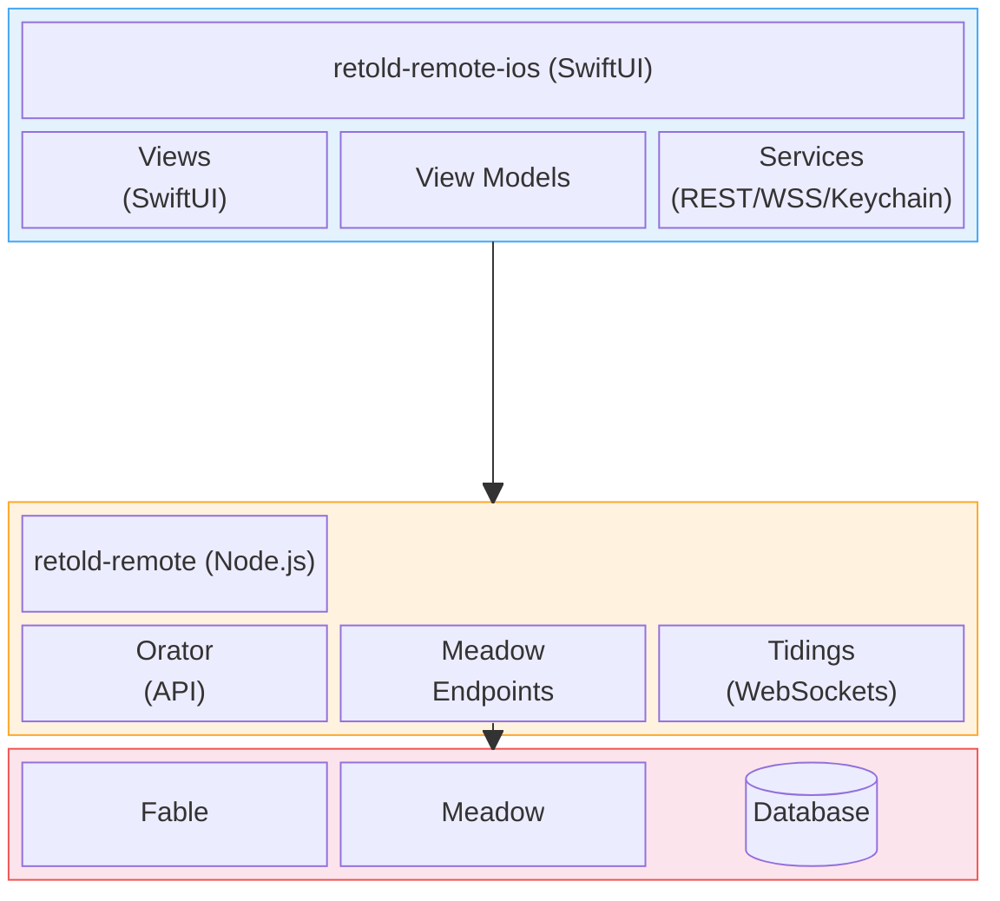

# retold-remote-ios

> A native iOS client for the Retold Remote application server.

`retold-remote-ios` is the Swift/SwiftUI companion to [`retold-remote`](/apps/retold-remote/). It delivers dashboards, data records, file transfers, and realtime events from a Retold ecosystem server directly to iPhone, iPad, and Apple Silicon Macs.

Like the rest of the Retold suite, it treats the server as the source of truth. The iOS app is a *thin edge* -- it never holds authoritative state, it never runs its own endpoints, and it defers every decision it can to the Fable/Meadow/Orator stack on the other end of the wire.

## Where It Fits

The app talks **only** to `retold-remote`. It speaks HTTPS for REST calls, WSS for Tidings realtime channels, and APNs for push notifications. Everything else -- database access, auth backends, business rules -- lives on the server.

## Highlights

- **Native SwiftUI**, iOS 16 and later, iPadOS and Mac Catalyst supported
- **Typed REST client** generated around the Meadow-Endpoints shape
- **Tidings realtime** over a single resilient WebSocket connection
- **Keychain-backed auth** with Face ID / Touch ID unlock
- **Offline cache** backed by SQLite with an outbox for deferred writes
- **Background uploads** so media survives app suspension
- **Certificate pinning** (opt-in) for high-security deployments

## Documentation

The full documentation is published via [`pict-docuserve`](/pict/pict-docuserve/). Open `docs/index.html` in a browser, or browse the source Markdown directly:

- **[Overview](overview.md)** -- what the app is, what it isn't, and how it relates to the rest of Retold
- **[Quickstart](quickstart.md)** -- clone, configure, and run against a local server in under ten minutes
- **[Architecture](architecture.md)** -- layered design, request lifecycle, realtime, security, and offline strategy, with a Mermaid diagram
- **[Reference](reference.md)** -- module-by-module tour of the source tree
- **[iOS Build & Package](ios-build-and-package.md)** -- building, debugging in the Simulator and on-device, TestFlight, and App Store submission

## Relationship to Other Retold Modules

| Module | Role | Used By |
|---|---|---|
| [`retold-remote`](/apps/retold-remote/) | The server the app connects to | Every feature |
| [`orator`](/orator/orator/) | API server framework | Server only |
| [`orator-authentication`](/orator/orator-authentication/) | Session and token auth | `AuthService` |
| [`meadow-endpoints`](/meadow/meadow-endpoints/) | Auto-generated REST for records | `RemoteClient` |
| [`tidings`](/orator/tidings/) | WebSocket realtime | `TidingsClient` |
| [`orator-static-server`](/orator/orator-static-server/) | File upload/download | `FileService` |
| [`fable`](/fable/fable/) | Server-side DI foundation | Server only |

## License

MIT -- see the repository `LICENSE` file. The same license as the rest of the Retold suite.

## Contributing

Bug reports and pull requests are welcome in the [retold](https://github.com/stevenvelozo/retold) monorepo. For larger changes -- new features, architectural shifts -- please open an issue first so we can talk through the design before you write Swift.
