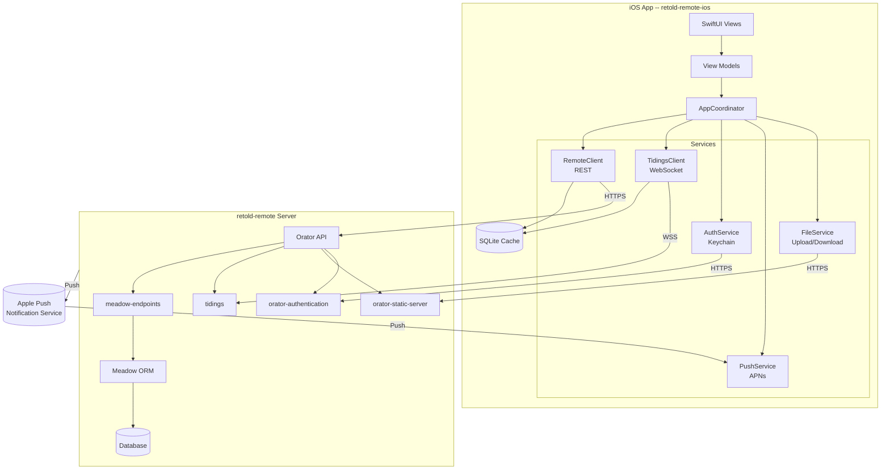

# Architecture

`retold-remote-ios` is organized as a small set of layers that mirror the shape of a Pict application on the web, but implemented in idiomatic Swift/SwiftUI.

## Layered Design

1. **Presentation** -- SwiftUI views and view models.
2. **Coordination** -- Navigation, session lifecycle, deep links.
3. **Services** -- Typed clients for REST, WebSockets, Keychain, APNs.
4. **Persistence** -- SQLite cache for offline browsing, `UserDefaults` for preferences.
5. **Transport** -- `URLSession` + `URLSessionWebSocketTask`.

Each layer depends only on the layer below it. The presentation layer never touches `URLSession` directly -- it goes through a service.

## Component Diagram



## Request Lifecycle

A typical read goes like this:

1. A SwiftUI view asks its view model for a list of records.
2. The view model calls `RemoteClient.list(entity:)`.
3. `RemoteClient` signs the request with the current session token (pulled from `AuthService`) and issues it via `URLSession`.
4. `retold-remote`'s Orator stack routes the request through `meadow-endpoints`, which queries Meadow, which issues SQL to the configured database.
5. The response comes back as JSON, is decoded into strongly-typed Swift models, and is mirrored into the SQLite cache.
6. The view model publishes the updated list via `@Published`, and SwiftUI re-renders.

Writes follow the same path in reverse, plus an optimistic update of the cache.

## Realtime via Tidings

`TidingsClient` holds a single `URLSessionWebSocketTask` connected to `wss://<host>/tidings`. On successful auth, it subscribes to the channels the user is entitled to. Every message is a JSON envelope:

```json
{ "channel": "records.customer", "event": "update", "id": 42, "version": 7 }
```

The client translates envelopes into `Combine` publishers that view models subscribe to. On reconnect, the client replays the last-known sequence number so the server can fill gaps.

## Security Model

- **Token storage** -- session tokens and refresh tokens are written to the iOS Keychain with `kSecAttrAccessibleAfterFirstUnlockThisDeviceOnly`. They never touch `UserDefaults` or disk files.
- **Biometric gate** -- on launch, `AuthService` prompts with Face ID / Touch ID before releasing the token.
- **ATS** -- App Transport Security is enforced in release builds. `NSAllowsArbitraryLoads` is only set in the debug `.xcconfig`.
- **Certificate pinning** -- optional. `RemoteClient` supports pinning by SPKI hash; pins are declared in `Info.plist`.
- **Token refresh** -- `RemoteClient` transparently refreshes on `401` and retries the original request once.

## Offline Strategy

The SQLite cache is a strict mirror -- it is never the source of truth. On launch, the app surfaces cached data immediately while kicking off a background sync. Writes made while offline are queued in an outbox table and flushed when the network returns. Conflicts are resolved last-writer-wins by default; per-entity resolvers are supported via the `ConflictResolver` protocol.

## Dependency Injection

The app uses a tiny hand-rolled service locator (`AppContainer`) rather than a framework. It mirrors the Fable service provider pattern: every service has a protocol, an implementation, and a registration at app bootstrap. Tests replace registrations with fakes.
